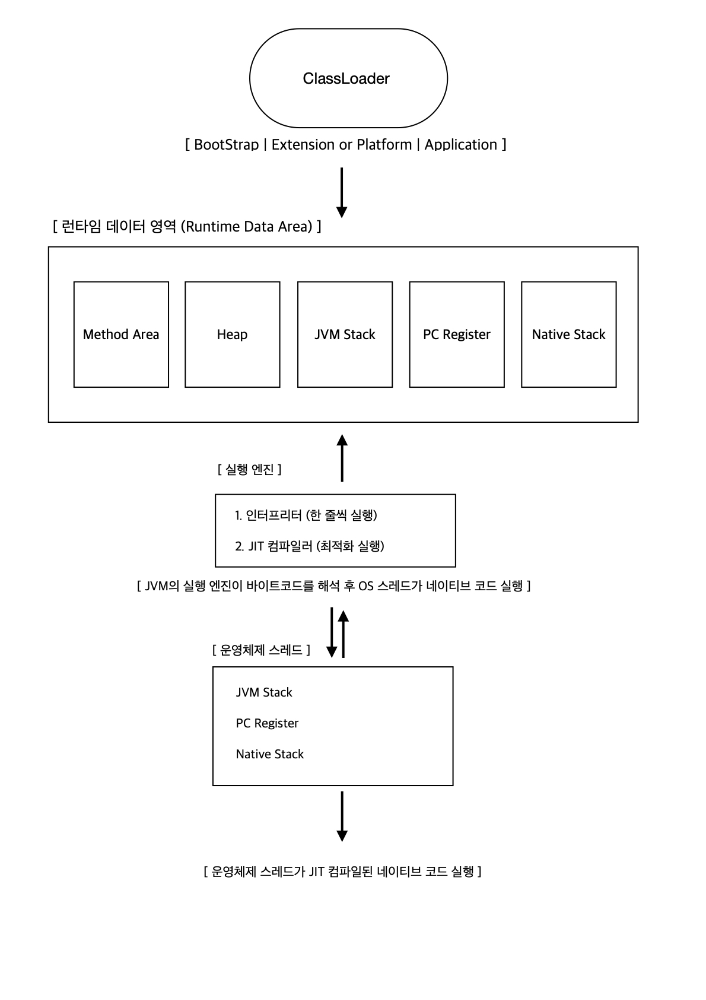

## JVM 동작 방식과 구성 요소

> Java 프로그램은 .java 소스 코드에서 시작해 .class 바이트코드로 변환되고,  
> 이를 실행하는 주체가 바로 JVM(Java Virtual Machine) 입니다.  
> 이번 글에서는 JVM의 구성 요소와 클래스 로딩 과정, 그리고 메모리 동작 방식을 정리해보겠습니다.

## 1. JVM의 주요 구성 요소


*그림 1: JVM 전체 아키텍처*

- **ClassLoader**: 클래스를 로드하는 역할
- **Runtime Data Area**: 실행 중 데이터를 저장하는 영역
- **Execution Engine**: 바이트코드를 해석하거나 컴파일해 실제 기계어로 실행
- **Java Native Interface (JNI)**: 네이티브 라이브러리(C/C++ 등)와 상호작용하는 인터페이스


## 2. Runtime Data Area
> JVM이 실행될 때 만들어지는 메모리 구조는 공유 영역과 비공유 영역으로 나눌 수 있습니다.

**(쓰레드 간 공유 영역)**
- **Method Area**: 클래스의 메타데이터, static 변수, 상수 풀 저장
  - (Java 8 이후 HotSpot JVM에서는 Metaspace로 구현됨)
- **Heap**: new 키워드로 생성되는 객체 인스턴스 저장

**(쓰레드 간 공유되지 않는 영역)**
- **JVM Stack**: 각 메서드 호출마다 스택 프레임 생성 (지역 변수, 피연산자 스택, 리턴 주소 등 포함)
- **PC Register**: 현재 실행 중인 명령어의 메모리 주소 저장
- **Native Stack**: 네이티브 코드 실행을 위한 공간


## 3. Execution Engine
- **Interpreter**: 바이트코드를 한 줄씩 해석해 실행
- **JIT(Just-In-Time) Compiler**: 자주 실행되는 바이트코드를 기계어로 변환하여 성능 향상


## 4. 클래스 로딩 과정
> 클래스 로딩은 다음과 같은 3단계로 진행됩니다. 

### **1️⃣ 로딩 (Loading)**
- `.class` 파일을 **메모리에 로드**
- **상수 풀**에서 기본 타입 리터럴 및 메서드 이름 등의 심볼 정보 저장

### **2️⃣ 링킹 (Linking)**
- **검증(Verification)**: 바이트코드의 유효성 검사
- **준비(Preparation)**: `static` 변수를 **기본값으로 초기화**
- **해석(Resolution) - 중요!**
  - **클래스가 처음 메서드 영역(Method Area)에 로드될 때, 심볼 정보(symbolic references)는 메모리 영역에 임의의 값으로 저장됨**
  - **이 심볼릭 레퍼런스를 실제 메모리 주소로 변환하는 과정이 해석(Resolution)**
  - **JVM은 런타임에 동적 연결을 수행하여, 특정 클래스, 필드, 메서드 참조를 실제 메모리 주소로 바꿈**
  - **특히 인터페이스 메서드 호출 시, 런타임에 동적 바인딩이 이루어짐**
  - **예를 들어, `Method Area`에 로드될 때 `java.lang.String`의 `hashCode()`를 호출하면, 처음에는 심볼릭 참조(문자열 형태)였지만, 해석 후 실제 주소를 가리킴**

### **3️⃣ 초기화 (Initialization)**
- `static` 변수에 **실제 값을 할당**
- `static` 블록 및 메서드 실행

## 5. ClassLoader란?
- **Bootstrap ClassLoader**: 기본 Java API 클래스 로드
- **Extension (Platform) ClassLoader**: `lib/ext`에 있는 확장 API 로드
- **Application (System) ClassLoader**: 사용자 정의 클래스를 로드

### **✔ 부모 위임 모델(Parent Delegation Model) - 중요!**
- **클래스를 로드할 때, 최상위 Bootstrap ClassLoader부터 확인 후, 없으면 자식 ClassLoader가 로드**
- **즉, Application → Extension → Bootstrap 순서로 부모에게 요청하며, 부모가 처리하지 못하면 자식이 직접 로드**
- **이 방식의 장점**
  - **보안 강화**: JDK 핵심 라이브러리(java.lang.String 등)의 재정의를 방지
  - **일관성 유지**: 동일한 클래스를 여러 번 로드하지 않음
- **영향이 있을까?**
  - **보안 취약점**: 만약 부모 위임을 깨고 Custom ClassLoader가 핵심 클래스를 재정의하면 보안 이슈 발생 가능
  - **ClassLoader Leak 문제**: 부모 위임 구조를 잘못 사용하면 GC에서 해제되지 않는 클래스가 남아 메모리 누수 발생 가능
  - **JVM 튜닝 가능성**: 일부 경우 성능 최적화를 위해 사용자 정의 ClassLoader를 사용하기도 함

## 6. 클래스 로딩 및 메모리 동작 예제

```java
class A {
  private static final String STR = "ABC"; // "ABC"가 **상수 풀(Method Area)** 에 저장됨
  private static Long l = Long.valueOf(-1L); // Heap에 저장됨
  private static int i = -1; // Method Area (static 변수 영역)에 저장됨
  private static C c = new C(); // Heap에 저장됨

  private final String a = "ABC";
  private final int ii = 1;
  private C cc = new C();

  public static void main(String[] args) {
    A a = new A(); // Heap에 객체 생성 (a, ii, cc 포함)
    B b = new B(); // Heap에 객체 생성 (B가 A를 상속하여 포함)
  }
}

class B extends A {
  public static void main(String[] args) {
    // 실행 코드
  }
}
```

✔ **클래스 로딩 과정에서 발생하는 메모리 변화**:
1. **클래스로더가 `A.class`를 메서드 영역(Method Area)에 로드**
2. `static final` 상수(`"ABC"`)는 **상수 풀(Constant Pool)에 저장**
3. **`static` 변수(`l`, `i`, `c`)는 Method Area에 저장**
4. **`new A()`를 호출하면 Heap에 객체가 생성됨**
5. **A가 B로 확장되면, B도 Heap에 저장되며, A의 데이터도 포함됨**


### **정리**
✔ **JVM은 ClassLoader, Runtime Data Area, Execution Engine, JNI로 구성됨** 
✔ **Runtime Data Area는 공유 영역(Heap, Method Area)과 비공유 영역(Stack, PC Register, Native Stack)으로 나뉨**  
✔ **클래스 로딩 과정: 로딩 → 링킹 → 초기화 순서로 진행**  
✔ **링킹(해석) 과정에서 심볼릭 레퍼런스를 실제 주소로 변환**  
✔ **클래스 로더는 부모 위임 모델을 사용하여 보안 및 성능을 최적화**  
✔ **잘못된 ClassLoader 사용 시 메모리 누수 또는 보안 취약점이 발생할 수 있음**  
